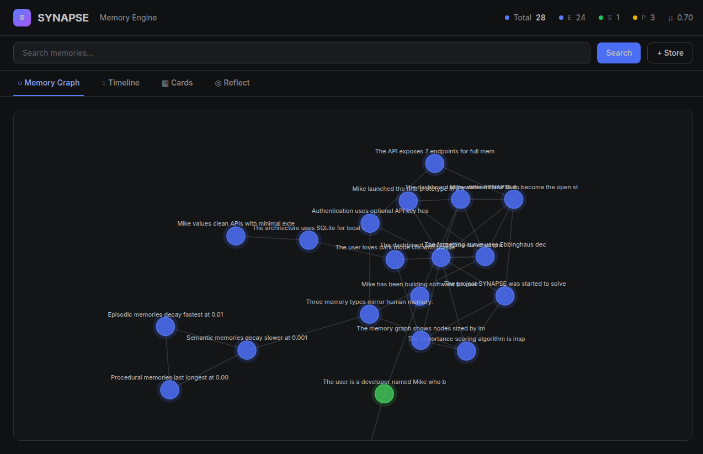

# SYNAPSE — Memory Layer for AI


**Every AI forgets everything. SYNAPSE fixes that.**

```python
from synapse import MemoryEngine

engine = MemoryEngine()
engine.store("Every AI forgets everything. SYNAPSE fixes that.")
results = engine.retrieve("AI memory")
```

SYNAPSE is a persistent, self-organizing memory engine that any AI model can plug into. It gives AI true long-term memory — persistent, private, and gets smarter over time. No cloud, no subscription, no vendor lock-in.

Built for AI agents, chatbots, and any application where context needs to survive beyond a single session.

---

## Why does this exist?

Every AI today — Claude, GPT, Gemini, local models — forgets everything the moment a conversation ends. Developers hack around this with naive solutions: stuffing chat history into prompts, basic vector databases, simple key-value stores. None of these work like human memory. None self-organize. None learn what matters and forget what doesn't.

SYNAPSE solves this at the architecture level.

## Architecture

SYNAPSE mirrors how human memory actually works with 3 memory types:

- **Episodic** — things that happened ("user mentioned they have a dog")
- **Semantic** — facts and knowledge ("user's name is Alex, they are a developer")
- **Procedural** — how to do things ("user prefers concise responses")

The engine self-organizes through periodic consolidation: merging duplicates, promoting frequently accessed memories, applying decay to old ones, and extracting semantic facts from episodic patterns.

## Quick Start

### Install

```bash
pip install synapse-memory

# For local embeddings (recommended):
pip install synapse-memory[embeddings]
```

> **⚠️ Without sentence-transformers, SYNAPSE falls back to 128-dim hash embeddings.** Retrieval quality will be noticeably poor. Always install `[embeddings]` for real use. The fallback works for development/testing only.

### Use it

```python
from synapse import MemoryEngine

engine = MemoryEngine()

# Store memories
engine.store("The user loves building AI infrastructure", source="conversation", tags=["user"])
engine.store("The user prefers dark mode with purple accents", source="conversation", tags=["preference"])

# Retrieve what's relevant
results = engine.retrieve("user preferences", top_k=5)
for r in results:
    print(f"[{r['combined_score']:.2f}] {r['memory']['content']}")

# Consolidate — self-organize
engine.consolidate()

# Forget what doesn't matter
engine.forget(threshold=0.1)

# Reflect — get a rich context block for any AI prompt
reflection = engine.reflect("user")
print(reflection["context_block"])
```

### Start the API

```bash
uvicorn api.main:app --reload
```

### Start the Dashboard

```bash
cd dashboard
npm install
npm run dev
```

## Dashboard

The SYNAPSE dashboard is a React + D3 interface that lets you see your AI's memory in real time — a force-directed graph of memory connections, importance heatmap, timeline of what was learned, and search.



## API Endpoints

| Method | Endpoint | Description |
|--------|----------|-------------|
| POST | `/memory` | Store a new memory |
| GET | `/memory/retrieve` | Query relevant memories |
| POST | `/memory/consolidate` | Trigger consolidation |
| POST | `/memory/forget` | Forget decayed memories |
| GET | `/memory/reflect` | Synthesize memories on a topic |
| DELETE | `/memory/{id}` | Delete a specific memory |
| GET | `/memory/stats` | Memory health statistics |
| GET | `/health` | Health check |

## How it works

**Importance Scoring** — each memory is scored 0.0–1.0 based on named entities, user preferences, connectivity, access frequency, and recency.

**The Forgetting Curve** — inspired by Ebbinghaus, memories decay at different rates per type:

```python
current_importance = base × e^(-decay_rate × days_since_access)
```

Episodic: 0.01/day | Semantic: 0.001/day | Procedural: 0.0001/day

**Consolidation** — the self-organizing step. Merges duplicates, promotes important memories, extracts semantic facts from episodic patterns.

> **Note:** Fact extraction (`consolidate()`) requires real usage over time. Memories are only promoted to semantic facts after 3+ accesses, so it won't trigger on a first run. Give it conversations, then consolidate — it gets smarter with use.

## Project Structure

```
synapse/
├── synapse/            # Core library
│   ├── store.py        # SQLite persistence
│   ├── engine.py       # Store, retrieve, consolidate, forget, reflect
│   ├── embeddings.py   # Local embedding generation
│   ├── importance.py   # Importance scoring heuristics
│   ├── decay.py        # Ebbinghaus forgetting curve
│   └── types.py        # Memory data model
├── api/                # FastAPI layer
│   ├── main.py
│   ├── schemas.py
│   └── routes/
│       ├── memory.py
│       └── health.py
├── dashboard/          # React + D3 dashboard
└── examples/           # Usage examples
```

## License

MIT — free for any use, personal or commercial.

---

**One person built this. One weekend. No permission needed.**

[GitHub](https://github.com/MikeDaGuyForStuff/synapse) — built by MikeDaGuyForStuff